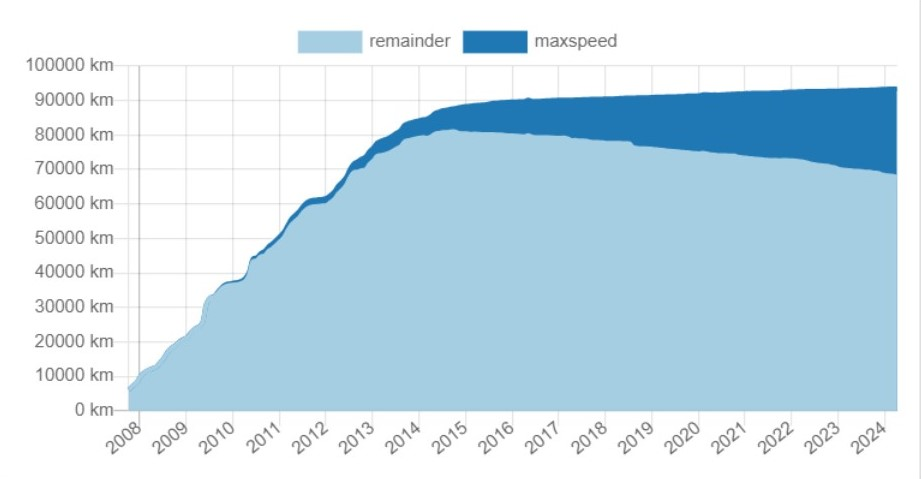

# Mesterséges Intelligencia projektfeladat
## Ismertető
Az OpenStreetMap egy szabad hozzáférésű és szerkesztésű térképi adatbázis. A szerkesztők heterogén eloszlásából és aktivitásból kifolyólag az adatfeltöltöttség is heterogén. 
A főbb útkategóriák[^1] hossza 93 ezer km. Ebből mindössze 26 ezer km-en elérhető sebességhatár (maxspeed) attribútum. A sebességhatárral nem rendelkező útszakaszokból a legnagyobb kategória a lakóövezeti útszakaszok 37 ezer kmt tesznek ki. Bár a sebességhatárral rendelkező útszakaszok aránya 2014 óta folyamatosan nő, messze még a teljes lefedettség.

A projekt célja, hogy a hiányzó sebességhatár adatokat gép tanulással pótolja. Ehhez több egyéb szabadon elérhető adatforrás is felhasználható, de első sorban az OpenStreetMap adatbázisban eleve fellelhető adatokkal tettem próbát. Ilyenek például az útszegmensek egyéb, meglévő adatai, mint például: útkategória, sváok száma, útburkolat típusa stb. Illetve ilyenek lehetnek még egyéb pontszerű adatok mint a gyalogosátkelőhelyek, közlekedési lámpák, kereszteződések stb. Ezt kiegészítendő, használhatóak a https://www.mapillary.com/ weboldalről letöltött közlekedési táblák. (Tervben van a későbbiekben további adatforrások bevonása, mint például az EU-s National Access Point-ok https://napcore.eu/description-naps/national-access-point/) 

## Módszer
Az adatfeldolgozás első lépése az adatok letöltése a https://www.geofabrik.de/data/download.html és a https://www.mapillary.com/ honlapokról. Előbbi egyszerűen letölthető egy protobuff formátumban, utóbbi már kicsit több munkát igényel egy API-n keresztül. 

Az adatok ezután egy PostgreSQL adatbázisba kerülnek feltöltésre, ahol adattisztításon és némi feature engineeringen esnek át. A további adatfeldolgozás és a deep learning modell tanítása pythonban történik. Ennek részletes leírása a [process](https://github.com/588chm/isa/tree/main/BME/AI/process) mappában található jupiter notebookokban látható.

[^1]: highway in (living_street,motorway,motorway_link,primary,primary_link,residential,rest_area,secondary,secondary_link,tertiary,tertiary_link,trunk,trunk_link,unclassified)
